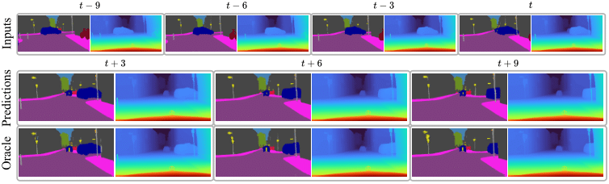

<div align="center">
<h1>Advancing Semantic Future Prediction through Multimodal Visual Sequence Transformers</h1>

**Efstathios Karypidis<sup>1,3</sup>, Ioannis Kakogeorgiou<sup>1</sup>, Spyros Gidaris<sup>2</sup>, Nikos Komodakis<sup>1,4,5</sup>**

<sup>1</sup>Archimedes/Athena RC <sup>2</sup>valeo.ai  
<sup>3</sup>National Technical University of Athens  <sup>4</sup>University of Crete   <sup>5</sup>IACM-Forth

[](https://arxiv.org/abs/2501.08303)
[](https://colab.research.google.com/drive/1fS51KGb1nwDiLplVcM4stypQe3Qtb5iW?usp=sharing)
[](https://opensource.org/licenses/MIT)
[](https://huggingface.co/Sta8is/FUTURIST/blob/main/futurist.ckpt)
[](https://huggingface.co/papers/2501.08303)

</div>



<br>

This repository contains the official implementation of the paper: **Advancing Semantic Future Prediction through Multimodal Visual Sequence Transformers**

# Contents
1. [News-ToDos](#news-todos)
2. [Installation](#installation)
3. [Dataset Preparation](#dataset-preparation)
4. [Futurist Training](#futurist-training)
5. [Evaluation](#evaluation)
6. [Demo](#demo)
7. [Citation](#citation)
8. [Acknowledgements](#acknowledgements)

# News-ToDos
**2025-1-14**: [Arxiv Preprint](https://arxiv.org/abs/2501.08303) and GitHub repository are released!
- [ ] Add new branches with code for training with vq-vae & separate tokens for each modality 

# Installation
The code is tested with Python 3.11 and PyTorch 2.0.1+cu121 on Ubuntu 22.04.05 LTS.
Create a new conda environment:
```bash
conda create -n futurist python=3.11
conda activate futurist
```

Clone the repository and install the required packages:
```bash
pip install torch==2.2.0 torchvision==0.17.0 torchaudio==2.2.0 --index-url https://download.pytorch.org/whl/cu121   
git clone https://github.com/Sta8is/FUTURIST
cd FUTURIST
pip install -r requirements.txt
```

# Dataset Preparation
We use Cityscapes dataset for our experiments. Especially, we use the `leftImg8bit_sequence_trainvaltest` sequences. In order to extract segmentation maps we utilize [Segmenter](https://github.com/rstrudel/segmenter). In order to extract depth maps we utilize [DepthAnythingV2](https://github.com/DepthAnything/Depth-Anything-V2). You can skip downloading `leftImg8bit_sequence_trainvaltest` and preprocessing and simply download the precomputed segmentation maps from [here](https://drive.google.com/file/d/1PpXcFm_8gQP_g7H-hAR2-QRUmTH9jXlw/view?usp=sharing) and depth maps from [here](https://drive.google.com/file/d/1o-JyuA4l4vG4rEIF-gZTS2RyS3jRMf31/view?usp=sharing). Also, in order to evaluate futurist `gtFine` needs to be processed using cityscapesScripts. Alternatively, you can download the processed dataset from [here](https://drive.google.com/file/d/1kd8KzEf8S5jlMAIPMoxOqW2cbjSlCs4w/view?usp=sharing). The final structure of the dataset should be as follow.

```
cityscapes
│
├───leftImg8bit_sequence_depthv2
│   ├───train
│   ├───val
├───leftImg8bit_sequence_segmaps_ids
│   ├───train
│   ├───val
├───gtFine
│   ├───train
│   ├───val
│   ├───test
```

# Futurist-training
To train Futurist with default parameters use the following command:
```bash
python train_futurist.py --num_gpus=8 --precision 16-mixed --eval_freq 10 --batch_size 2  --max_epochs 3200 --lr_base 4e-5 --patch_size 16 \
    --eval_mode_during_training --evaluate --single_step_sample_train  --masking "simple_replace" --seperable_attention --random_horizontal_flip \
    --random_crop --use_fc_bias --data_path="/path/to/cityscapes/leftImg8bit_sequence_segmaps_ids" --modality segmaps_depth \
    --sequence_length 5 --num_classes 19 --emb_dim 10,10 --accum_iter 4 --w_s 0.85 \
    --dst_path "/logdir/futurist" --masking_strategy "par_shared_excl" --modal_fusion "concat" 
```
# Evaluation
You can also download the pre-trained model from [here](https://huggingface.co/Sta8is/FUTURIST/blob/main/futurist.ckpt) or via CLI using
```bash
wget https://huggingface.co/Sta8is/FUTURIST/resolve/main/futurist.ckpt
```

To evaluate Futurist trained model use the following command:
```bash
python train_futurist.py --num_gpus=4 --precision 16-mixed --eval_freq 10 --batch_size 2  --max_epochs 3200 --lr_base 4e-5 --patch_size 16 \
    --eval_mode_during_training --evaluate --single_step_sample_train  --masking "simple_replace" --seperable_attention --random_horizontal_flip \
    --random_crop --use_fc_bias --data_path="/path/to/cityscapes/leftImg8bit_sequence_segmaps_ids" --modality segmaps_depth \
    --sequence_length 5 --num_classes 19 --emb_dim 10,10 --accum_iter 4 --w_s 0.85 \
    --dst_path "/logdir/futurist" --masking_strategy "par_shared_excl" --modal_fusion "concat" \
    --eval_ckpt_only --ckpt "/path/to/futurist.ckpt"
```

# Demo
We provide 2 quick demos. 

- [](https://colab.research.google.com/drive/1fS51KGb1nwDiLplVcM4stypQe3Qtb5iW?usp=sharing)
- [Demo](demo.ipynb).

# Citation
If you found Futurist useful in your research, please consider starring ⭐ us on GitHub and citing 📚 us in your research!
```bibtex
@InProceedings{Karypidis_2025_CVPR,
author = {Karypidis, Efstathios and Kakogeorgiou, Ioannis and Gidaris, Spyros and Komodakis, Nikos},
title = {Advancing Semantic Future Prediction through Multimodal Visual Sequence Transformers},
booktitle = {Proceedings of the Computer Vision and Pattern Recognition Conference (CVPR)},
month = {June},
year = {2025},
pages = {3793-3803}
```

# Acknowledgements
Our code is partially based on [Maskgit-pytorch](https://github.com/valeoai/Maskgit-pytorch), [DepthAnythingV2](https://github.com/DepthAnything/Depth-Anything-V2), [Segmenter](https://github.com/rstrudel/segmenter) for their work and open-source code.
